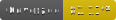

# GitHub Issue Bot Action



Automation for triaging GitHub issues and comments. The action watches issue
titles, bodies, and comments, then reacts with canned replies, labels, closing,
and assignments based on YAML rules.

## Features

- Regex-based matching across issue titles, bodies, and comments
- Filtering based on comment authorship (e.g., repository members)
- YAML-driven rules for conditions and actions
- Supported actions: comment, react, label, state, assign, and dispatch

## Basic Usage

1. Add a workflow that runs on issue and issue_comment events.
1. Create the YAML configuration file (default path shown above) to define
   matching rules and actions.

Example workflow file `.github/workflows/issue-bot.yml`:

```yaml
name: Issue Bot
on:
  issues:
    types: [opened, edited, reopened]
  issue_comment:
    types: [created]

jobs:
  triage:
    runs-on: ubuntu-latest
    permissions:
      contents: read
      issues: write
      pull-requests: write
    steps:
      - uses: actions/checkout@v4
      - name: Run issue bot
        uses: ngc7331/actions-issue-bot@v1
        with:
          token: ${{ secrets.GITHUB_TOKEN }}
```

## Inputs

- `config`: Path to the YAML configuration file. Default is
  `.github/issue-bot.yaml`.
- `token`: GitHub token with issues:write permission (or use GITHUB_TOKEN
  environment variable).

## Configuration

Create `.github/issue-bot.yaml` in your repository.

### Top-level Structure

```yaml
rules:
  rule_name:
    condition:
      - condition_type: condition_value
      # more conditions...
    action:
      action_type:
        # action parameters...
      # more actions...

global:
  - condition_type: condition_value
```

`rules` is a mapping of rule names to their definitions. Each rule consists of a
`condition` block and an `action` block.

`condition` block is a list of `key: value` pairs. The `key` is the type of
condition (Refer to the [Condition Types](#condition-types) section below), and
the `value` is the condition value.

`action` block defines the actions to take when the conditions are met. It can
include `comment`, `react`, `label`, `state`, `assign`, and `dispatch` actions.
Refer to the [Action Types](#action-types) section below for details.

`global` is a list of conditions that apply to all rules. If specified, only
issues/comments that satisfy all global conditions will be considered for rule
matching. It shares the same format as the `condition` block in rules.

### Condition Types

#### condition-`regex`

Matches the specified regular expression against issue body (when issue is
opened, edited or reopened), or comment (when comment is added to an issue).

Example:

```yaml
- regex: 'bug|error|fail'
```

#### condition-`regex_title`

Matches the specified regular expression against issue title.

Example:

```yaml
- regex_title: 'bug|error|fail'
```

#### condition-`member`

Should bot consider comments from repository members. Possible values:

- `include`: bot will consider comments from repository members when matching
  conditions. This is the default behavior.
- `exclude`: bot will ignore comments from repository members when matching
  conditions.
- `only`: bot will only consider comments from repository members when matching
  conditions.

Example:

```yaml
- member: exclude
```

#### condition-`event_type`

Matches the event type. Possible values are `issues`, `issue_comment` and
`pull_request`. This condition is useful when you want to trigger actions only
on certain events.

Example:

```yaml
- event_type: issues
```

#### condition-`state`

Matches the state of the issue. Possible values are `open` and `closed`.

Example:

```yaml
- state: open
```

#### condition-`and`

All conditions in the list must be satisfied.

```yaml
- and:
    - regex: 'bug|error|fail'
    - member: exclude
```

This rule matches comments that contain "bug", "error", or "fail", but only if
the comment author is not a repository member.

#### condition-`or`

At least one condition in the list must be satisfied.

```yaml
- or:
    - regex: 'bug|error|fail'
    - member: only
```

This rule matches comments that either contain "bug", "error", or "fail", or are
made by repository members.

#### condition-`not`

The condition in the list must not be satisfied.

```yaml
- not:
  regex: 'bug|error|fail'
```

This rule matches comments that do not contain "bug", "error", or "fail".

Note that `not` should not be used with `member` condition, as it can lead to
ambiguous logic. For example, `not: member: include` does NOT mean
`member: exclude`, but rather matches nothing, since the condition
`member: include` is satisfied for all comments (including those from members
and non-members).

Used with `regex` or `regex_title` is the only recommended usage of `not`.

### Action Types

#### action-`comment`

Comments on the issue or comment with the specified text.

Supports simple templating with `{{ }}`. Refer to the
[Template Variables](#template-variables) section below for available variables.

Example:

```yaml
comment:
  message: 'Hello world {{ issue.author }}'
```

#### action-`react`

NOTE: **Experimental, use with caution**

Adds the specified reaction to the comment or issue.

You can specify reactions to add with `add`, reactions to remove with `remove`,
or remove all reactions (before adding new) with `remove_all`.

`add` and `remove` fields can be a single string or a list of strings.

Supported reactions are `+1`, `-1`, `laugh`, `confused`, `heart`, `hooray`,
`rocket`, and `eyes`. Refer to
[GitHub API documentation](https://docs.github.com/rest/reactions/reactions) for
details.

Example:

```yaml
react:
  add: 'rocket'
  remove: 'eyes'
  remove_all: false
```

#### action-`label`

Adds or removes labels from the issue.

You can specify labels to add with `add`, labels to remove with `remove`, or
remove all labels (before adding new) with `remove_all`.

`add` and `remove` fields can be a single string or a list of strings.

Example:

```yaml
label:
  add: 'bug/confirmed'
  remove: 'bug/reported'
  remove_all: false
```

#### action-`state`

Closes, or reopens the issue with the given reason. Supported reasons are
`completed`, `not_planned`, and `reopened` (Refer to
[GitHub API documentation](https://docs.github.com/rest/issues/issues#update-an-issue)
for details).

Example:

```yaml
state:
  reason: completed
```

#### action-`assign`

Assigns the issue to the specified users. You can specify users to add with
`add`, users to remove with `remove`, or remove all assignees (before adding
new) with `remove_all`.

The username listed here should be the GitHub login of the user, not their
display name. And the user must have write access to the repository to be
assigned.

`add` and `remove` fields can be a single string or a list of strings.

Example:

```yaml
assign:
  add: 'member233'
  remove: 'member666'
  remove_all: false
```

#### action-`dispatch`

Dispatches another workflow in the same repository.

- `name`: workflow file name or workflow ID (required)
- `ref`: git ref to run on (optional). If omitted, GitHub uses the default
  branch.
- `inputs`: key-value map passed to `workflow_dispatch` inputs (optional).
  Values can be string, number, or boolean and will be converted to strings.
  `null` and `undefined` are ignored.

All fields support simple templating with `{{ }}`. Refer to the
[Template Variables](#template-variables) section below for available variables.

Example:

```yaml
dispatch:
  name: 'run-test.yml'
  ref: 'main'
  inputs:
    author: '{{ issue.author }}'
```

### Template Variables

#### variable-`issue.author`

The username of the issue author.

#### variable-`comment.author`

The username of the comment (when comment is added to an issue) / issue (when
issue is opened, edited or reopened) author.

### Examples

#### Incomplete Attachment Detection

```yaml
rules:
  incomplete_attachment:
    condition:
      - or:
          - regex: '<!-- Uploading .*? -->'
          - regex: '<!-- Failed to upload .*? -->'
      - member: exclude
    action:
      comment:
        message:
          '@{{ comment.author }} seems you have a incomplete upload. Please
          check.'
      label:
        add: 'more info needed'
```

This rule matches issue body or comments that contain either
`<!-- Uploading ... -->` or `<!-- Failed to upload ... -->`, but only if the
comment author is not a repository member. When the rule matches, the bot
comments on the issue or comment, mentioning the issue/comment author.
